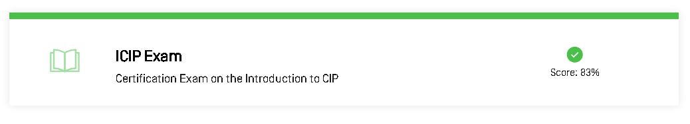

# 🏭 Introduction to Critical Infrastructure Protection (CIP) – ICIP OSWAT

This repository contains all my learning notes, demo labs, practicals, screenshots, and certificate for the course **"Introduction to CIP (Critical Infrastructure Protection)"** by ICIP – OSWAT.

---

## 📚 Course Notes

- 🧱 [`cip-foundations.md`](./notes/cip-foundations.md) – Definitions, sectors, and ICS environment
- 🛠️ [`ics-architecture.md`](./notes/ics-architecture.md) – Purdue Model, protocols, physical layers
- 🔐 [`cip-controls-framework.md`](./notes/cip-controls-framework.md) – NERC CIP, ISO, and other frameworks

---

## 🧪 Demo Labs

- ⚙️ [`asset-inventory-lab.md`](./demo/asset-inventory-lab.md) – Simulated ICS asset discovery
- 🌐 [`network-segmentation-lab.md`](./demo/network-segmentation-lab.md) – IT/OT VLAN segmentation with `iptables`

---

## 💻 Practicals

- 🧠 [`scada_log_anomaly.py`](./practicals/scada_log_anomaly.py) – Anomaly detection in simulated SCADA logs

---

## 🧭 Security Operations Strategy

- 🚨 [`incident-escalation-framework.md`](./strategy/incident-escalation-framework.md) – Response ladder for ICS/CIP environment
- 🛡️ [`ics-hardening-principles.md`](./strategy/ics-hardening-principles.md) – System hardening, patching, and physical security
- 🔄 [`redundancy-and-resilience.md`](./strategy/redundancy-and-resilience.md) – Fault tolerance & industrial backups

---

## 📸 Screenshots

| Description             | Screenshot                                      |
|-------------------------|-------------------------------------------------|
| 🧩 Course Modules        |             |
| 🏗️ CIP Foundations       |             |
| ✅ Course Conclusion     |        |

---

## 🎓 Certificate

- 📜 [`certificate-introduction-to-cip.pdf`](./cert/certificate-introduction-to-cip.pdf)

---

## 📝 Course Review: Introduction to CIP – ICIP OSWAT

This course serves as a strong primer for anyone interested in the **protection of industrial control systems**. It blends policy, governance, and technical models into a well-structured format.

✅ **What I Liked**:
- Clear separation between IT and OT threat models
- Focus on real-world ICS examples (PLC, HMI, SCADA)
- Hands-on examples encouraged contextual thinking

📌 **To Improve**:
- Would benefit from lab challenges (e.g., identifying misconfigurations)
- Could include more modern threats like ransomware in OT

---

## 🚧 Ongoing Work

Additional deep-dive demos and strategy docs (e.g., `ICS Forensics`) are in progress.

---

## 🤝 Code of Conduct

We commit to respectful, inclusive communication.  
See [`CODE_OF_CONDUCT.md`](./CODE_OF_CONDUCT.md)

---

## ✍️ Author

**Thành Danh** – Pentester & Cybersecurity Research  

- GitHub: [@ngvtdanhh](https://github.com/ngvtdanhh)  
- Email: ngvu.thdanh@gmail.com

---

## 📄 License

This project is licensed under the **GNU AGPL v3.0**.  
See [`LICENSE`](./LICENSE) for details.

© 2025 ngvtdanhh. All rights reserved.
